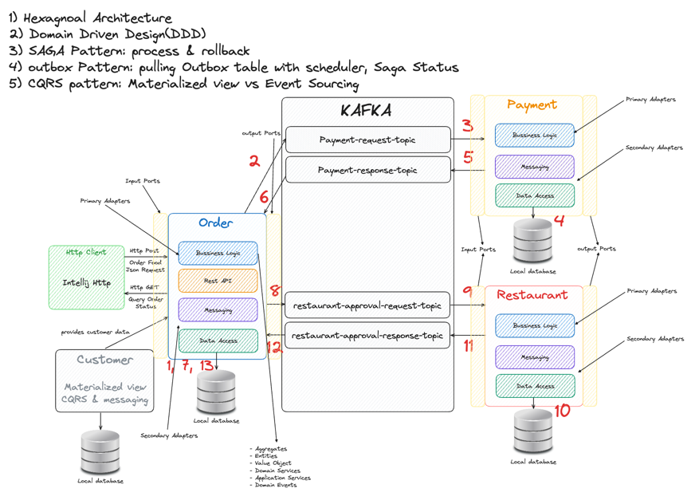

### MSA를 연습해보기 위한 리포지토리입니다.
#### DDD, Heaxgonal Architecture, Saga pattern, Outbox Pattern, CQRS pattern을 적용해 볼 예정입니다.

---

위의 구성도처럼 여러개의 서버에 걸쳐 트랜잭션을 적용하는 것이 목표입니다. 

---
#### FEAT1: 초기 프로젝트 구성
- docker-compose 파일들을 작성
- 프로젝트를 위한 모듈 생성
- 사용할 시스템 아키텍쳐의 구성도 추가